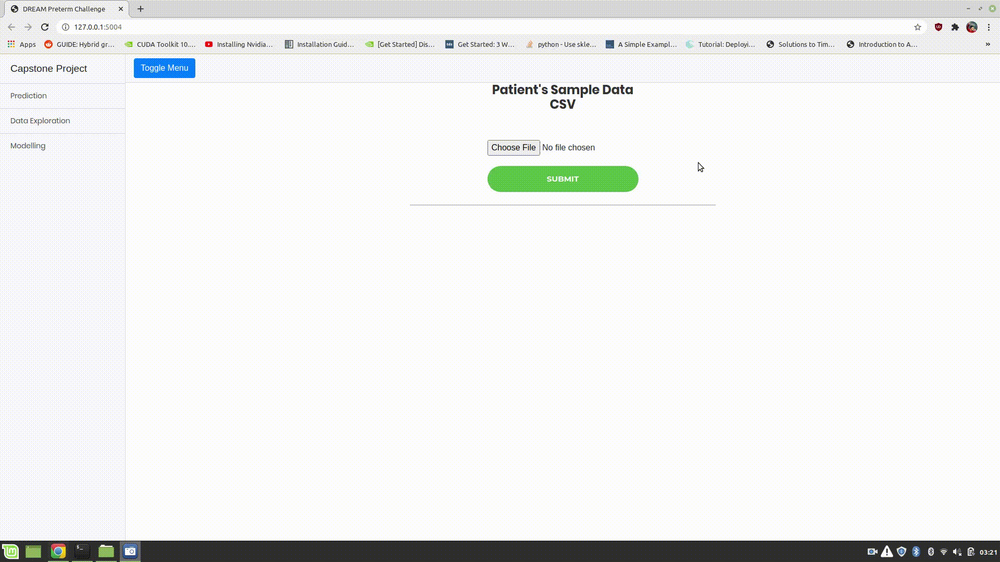

# Predicting-Preterm-Birth---Webapp

## Instructions:
flask run in terminal from the root directory

### For more information see the [slides](https://drive.google.com/file/d/1nlHIC6AKiD4liQnnST90SpgS2mHCKWNr/view?usp=sharing).

Predicting the probability of Spontaneous preterm delivery (sPTD) and Preterm premature rupture of the membrane (PPROM) births:

Exploratory Data Analysis:

Model Selection:

• Created an interactive dashboard through which a user can get the probability of a preterm birth when they upload the
blood sample of a woman and can also see the analysis of the dataset using Flask and JavaScript. (for testing user can upload the file in the uploads folder) \
• Predicted probability of preterm birth (Spontaneous preterm delivery (sPTD) and Preterm premature rupture of the
membrane (PPROM)) using samples collected during pregnancy in women (challenge hosted on [synapse.org](https://www.synapse.org/#!Synapse:syn18380862/wiki/590485) ). \
• Performed exploratory data analysis and experimented with different feature selection methods including HSIC Lasso,
Information Gain and Mann Whitney U-test, found 5 significant genes out of 29,459 genes. \
• Developed an ensemble using Logistic Regression, LDA, XGBoost and Random forest with repeated cross-validation to get
improved generalization performance as it was the case of a small n large p problem (450 samples & 29459 features). \
• Achieved an AURUC score of 0.713 for PPROM and 0.55 for sPTD achieving a rank of 12 among 122 participants. \

User can also see the analysis and modelling part of the project throught the application. \

